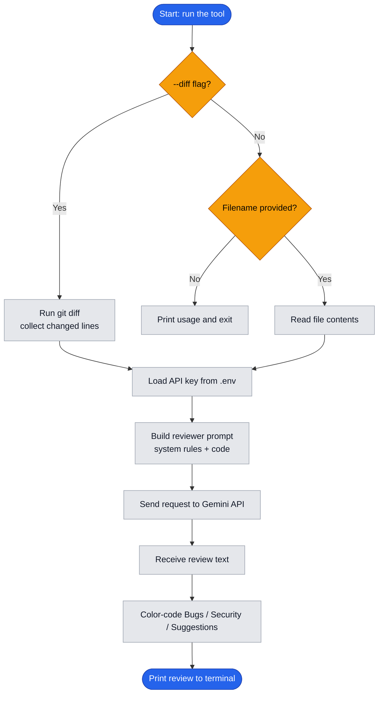

# Gemini Code Reviewer

A command-line tool that reviews code using Google's Gemini models. Point it at a
file or at your uncommitted git changes, and it reports bugs, security issues, and
suggested improvements right in your terminal.

## Features

- Review an entire file, or only your staged/unstaged git changes (`--diff`)
- Focused output grouped into **Bugs**, **Security**, and **Suggestions**
- Color-highlighted headings for quick scanning
- Friendly error handling for missing files, missing keys, and non-git folders

## Requirements

- Python 3.10+
- A Google Gemini API key (free tier available at https://aistudio.google.com/apikey)

## Setup

1. Clone the repository:
   ```bash
   git clone https://github.com/prem-maradiya/gemini-code-reviewer.git
   cd gemini-code-reviewer
   ```

2. Create a virtual environment and install dependencies:
   ```bash
   python -m venv venv
   venv\Scripts\activate        # Windows
   # source venv/bin/activate   # macOS / Linux
   pip install google-genai python-dotenv colorama
   ```

3. Create a `.env` file in the project root with your API key:
   ```
   GEMINI_API_KEY=your_key_here
   ```

## Usage

Review a single file:
```bash
python reviewer.py example.py
```

Review your uncommitted git changes:
```bash
python reviewer.py --diff
```

On Windows you can also use the included launcher:
```bash
.\review example.py
.\review --diff
```

## How it works

1. Loads the API key from `.env`.
2. Collects the code to review — either by reading a file or by running `git diff`.
3. Sends it to Gemini with a reviewer prompt tuned for signal over noise.
4. Prints the review with color-coded sections.



## Project structure

| File | Purpose |
|------|---------|
| `reviewer.py` | Main command-line tool |
| `review.bat` | Windows launcher |
| `example.py` | Sample file with intentional issues, for trying the tool |

## License

MIT
